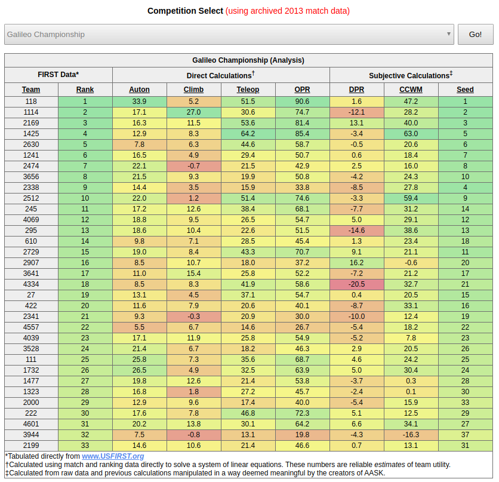

adambots-automated-scouting-kit
===============================

The "Adambots Automated Scouting Kit" (AASK) is a tool designed to aid the scouting efforts of FIRST FRC teams.

How Does It Work?
-----------------

For each point category, our system solves a system of linear equations for the "average contribution" of each team per match. Each equation corresponds to a single team and expresses the total accumulated points earned by that team as a linear combination of that team's average contribution and the average contributions of every other team that has competed on an alliance with that team. Naturally, we represent the system of equations with a single matrix equation of the form Ax=b

Vector b contains the aggregate point value (one of AP, CP, TP, or their sum) for each team.
Each element A(i,⁣)j of matrix A represents the number of times team i has played with team j. Each element on the diagonal, therefore, is the total number of matches played by the team represented by that row and column. As a result, our matrix has the following properties:
- It is symmetric.
- It is irreducibly diagonally dominant.
We solve for the vector x, which contains the average contribution of each team.
Because of the special properties of our matrix, we can easily find an exact solution when the matrix is nonsingular using LU Factorization (without pivoting!) followed by forward- and back-substitution. When the matrix is singular, we approximate the solution iteratively with the Gauss-Seidel method and display a warning to the user.

The Defensive Power Rating (DPR) for a team is calculated by iterating through the list of completed matches and using the calculated OPR values to predict the outcome of each match. For each match, for both alliances, the difference between this expected outcome and the true outcome of the match is credited to the defensive utility of the opposing alliance. For each team, we sum up these differences and solve a linear system similar to the one above using this new tabulated data.

The Calculated Contribution to the Winning Margin (CCWM) for each team is calculated by summing up the alliance score difference for each team for each match and solving our favorite system of linear equations for the x vector with these margins in our b vector.

AASK is dependent on the match schedule and rankings reported by www.USFIRST.org. Occasionally, the FIRST website will experience an outage, rendering our tool temporarily incapacitated. We have implemented a simple caching system, designed to reduce the frequency of such failures, but ultimately the status of the FIRST website controls the functionality of this tool.
